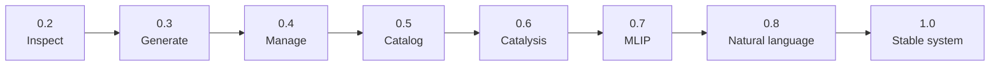

# atomix Roadmap

This roadmap defines what each Atomix release must deliver. A minor release adds
one end-to-end capability. Patch releases contain compatible fixes, docs, and
small refinements.

## Product Goal

Build a natural-language-assisted toolkit for atomistic modeling workflows that lets a computational materials researcher describe what they want to simulate, then reliably generate, run, inspect, and analyze VASP-first workflows with a path toward MLIP-accelerated screening.

The useful product is not a chatbot demo. The useful product is a trustworthy workflow layer: structure context, calculation setup, job submission, result parsing, and analysis, with natural language as an interface on top of reproducible scientific primitives.

## Current Status

- Early scaffolding exists for CLI commands, VASP input generation, calculation classes, workflow orchestration, site tools, analysis helpers, MLIP wrappers, and AI generation.
- CI and tests exist.
- README states most features are still stubs.
- A supported `inspect-vasp` CLI and Python API read segmented VASP outputs without modifying them.
- The historical `atomix-pypi-release/` placeholder is preserved but excluded from package discovery.
- The source version is `0.2.0`; its CI, wheel, clean install,
  and read-only inspection path are verified.
- No license is declared for the current source. This does not technically
  block a PyPI release; licensing will be revisited as the product boundary
  becomes clearer.
- API churn is expected throughout the `0.x` series.

## Priority Scale

- `P0`: required for the next planned release.
- `P1`: core MVP functionality for real local use.
- `P2`: expansion after core workflows are stable.
- `P3`: later research/product ideas.

## Size Scale

- `S`: 30-90 minutes, one focused change or audit.
- `M`: half day, multiple files or a small feature.
- `L`: one to two days, clear substeps.
- `XL`: too big for direct implementation; split before starting.

## Compute Tags

- `compute:none`: design/docs/API decisions.
- `compute:light`: local tests, lint, package build, mock workflows.
- `compute:network`: PyPI/GitHub/LLM-provider work.
- `compute:cluster`: Slurm/HPC integration or remote smoke tests.
- `compute:gpu`: MLIP screening or training/inference that needs GPU.
- `compute:agent`: good candidate for a separate agent chat.

## Release ladder

### 0.2.0 - Inspect existing VASP runs

Outcome: read segmented VASP calculations without modifying them.

- [x] Numeric segment discovery, provenance, time metadata, and boundary-frame handling.
- [x] XDATCAR trajectory with OUTCAR fallback and REPORT/OUTCAR diagnostics.
- [x] Supported `atomix inspect-vasp` CLI and Python API.
- [x] Tests pass on Python 3.10-3.13; wheel and clean installation pass in CI.

### 0.3.0 - Generate safe VASP inputs

Outcome: create inspectable inputs for supported calculation types without
submitting a job.

- [ ] Support static, relaxation, and AIMD input schemas.
- [ ] `atomix generate --dry-run` validates and previews all intended files.
- [ ] Write POSCAR, INCAR, KPOINTS, and an optional scheduler script only after validation.
- [ ] Document conservative defaults, POTCAR boundaries, and unsupported requests.
- [ ] Cover each supported calculation type with deterministic tests and one end-to-end example.

### 0.4.0 - Manage calculation execution

Outcome: submit, monitor, continue, and diagnose a VASP calculation.

- [ ] Choose the job-management boundary after evaluating atomate2/jobflow-remote.
- [ ] Generate Slurm submissions with a no-submit dry run.
- [ ] Classify not-started, running, incomplete, completed, and failed calculations.
- [ ] Handle segmented continuation without losing provenance.
- [ ] Return structured energy, force, and failure summaries.

### 0.5.0 - Catalog and query results

Outcome: answer questions across calculation directories from a local,
queryable record.

- [ ] Define a versioned calculation and result schema.
- [ ] Index existing runs without changing source calculation directories.
- [ ] Query structures, methods, parameters, status, energies, and provenance.
- [ ] Export portable tabular or columnar records with a documented migration path.

### 0.6.0 - Catalysis workflows

Outcome: provide tested surface-science workflows beyond generic setup.

- [ ] Enumerate common adsorption sites for simple metal slabs.
- [ ] Implement and document an adsorption-energy workflow.
- [ ] Validate one complete lightweight surface-adsorption example.

### 0.7.0 - MLIP screening and export

Outcome: use optional MLIP backends for screening and prepare reference data
for validation or fine-tuning.

- [ ] Keep MLIP backends optional and import-safe.
- [ ] Test screening commands with mocks and document at least one real backend.
- [ ] Export VASP-derived training data through a tested schema.
- [ ] Define, but do not over-automate, active-learning boundaries.

### 0.8.0 - Validated natural-language interface

Outcome: natural language controls trusted workflow primitives through typed,
validated requests.

- [ ] Map prompts to versioned parameter schemas before any file write.
- [ ] Add deterministic fixture tests and clear provider-failure behavior.
- [ ] Require an inspectable plan or dry run for consequential operations.

### 1.0.0 - Stable end-to-end system

Outcome: a documented and compatibility-managed workflow from setup through
execution, inspection, provenance, analysis, and optional natural-language use.

- [ ] Public CLI and Python APIs have an explicit compatibility policy.
- [ ] Core workflows are proven on multiple real calculation families.
- [ ] Installation, upgrades, data migration, and failure recovery are documented.
- [ ] Release scope, license, and support boundary are deliberate and explicit.

## Epics

### Epic: Packaging And Release

Goal: make atomix installable, testable, and releasable from one source tree.

Candidate tasks:
- Keep `atomix-pypi-release/` as a read-only historical snapshot excluded from package discovery (`done`).
- Move heavy dependencies to optional extras and lazy imports where needed (`P0`, `size:M`, `type:maintenance`, `area:package`, `compute:light`).
- Maintain package build and fresh-venv install smoke tests (`done`).
- Revisit licensing when the product boundary or proprietary extension path changes (`P2`, `size:S`, `type:decision`, `area:license`, `compute:none`).

### Epic: CLI And User Workflows

Goal: make the command-line surface coherent and useful before deeper features spread.

Candidate tasks:
- Audit current CLI commands and document stable vs experimental commands (`P0`, `size:S`, `type:audit`, `area:cli`, `compute:none`).
- Add or improve `atomix info` / environment diagnostics (`P1`, `size:S`, `type:feature`, `area:cli`, `compute:light`).
- Create a minimal end-to-end example for structure -> VASP inputs -> status/analyze (`P1`, `size:M`, `type:feature`, `area:cli`, `compute:light`).

### Epic: VASP Input Generation

Goal: generate conservative, inspectable VASP inputs using established libraries.

Candidate tasks:
- Define supported calculation types and default parameters for `0.3.0` (`P0`, `size:S`, `type:decision`, `area:vasp`, `compute:none`).
- Add tests for static, relax, and AIMD input generation (`P1`, `size:M`, `type:test`, `area:vasp`, `compute:light`).
- Document POTCAR handling and what atomix does not automate (`P1`, `size:S`, `type:docs`, `area:vasp`, `compute:none`).

### Epic: Workflow And Job Management

Goal: support direct ASE/MLIP workflows and file-based DFT workflows without mixing their assumptions.

Candidate tasks:
- Clarify direct mode vs file mode in docs and tests (`P1`, `size:S`, `type:docs`, `area:workflow`, `compute:light`).
- Add Slurm script generation tests for common VASP settings (`P1`, `size:M`, `type:test`, `area:workflow`, `compute:light`).
- Evaluate atomate2/jobflow-remote as a backend instead of expanding custom job management (`P1`, `size:M`, `type:research`, `area:workflow`, `compute:none`).

### Epic: Analysis And Catalysis

Goal: provide useful scientific primitives for surface/catalysis workflows.

Candidate tasks:
- Add a documented adsorption-energy example using mock/lightweight calculators (`P1`, `size:M`, `type:feature`, `area:analysis`, `compute:light`).
- Tighten energy/forces/trajectory analyzer outputs and JSON schemas (`P1`, `size:M`, `type:feature`, `area:analysis`, `compute:light`).
- Expand surface-site enumeration tests for simple facets (`P2`, `size:M`, `type:test`, `area:sites`, `compute:light`).

### Epic: MLIP Workflows

Goal: make MLIPs a validated acceleration layer, not a vague claim.

Candidate tasks:
- Keep MLIP dependencies optional and import-safe (`P0`, `size:M`, `type:maintenance`, `area:mlip`, `compute:light`).
- Add a lightweight MLIP screening example with mocked backend and documented real backend (`P1`, `size:M`, `type:feature`, `area:mlip`, `compute:light`).
- Define training-data export schema for VASP outputs (`P1`, `size:M`, `type:feature`, `area:mlip`, `compute:light`).
- Later: integrate with a real Pt-water/MLIP validation workflow only after the standalone MLIP manuscript path is clearer (`P3`, `size:L`, `type:research`, `area:mlip`, `compute:gpu`).

### Epic: Natural Language Layer

Goal: expose reliable workflow primitives through natural language only after the primitives have stable schemas.

Candidate tasks:
- Define output schema for NL-generated calculation setup (`P1`, `size:M`, `type:feature`, `area:ai`, `compute:none`).
- Add validation layer between LLM output and file writing (`P1`, `size:M`, `type:feature`, `area:ai`, `compute:light`).
- Add deterministic tests using fixture LLM responses (`P1`, `size:M`, `type:test`, `area:ai`, `compute:light`).
- Later: support provider selection and local docs context more robustly (`P2`, `size:M`, `type:feature`, `area:ai`, `compute:network`).

## Priority Backlog

| Priority | Task | Size | Compute | Depends On | Notes |
|---|---|---|---|---|---|
| P0 | Preserve but exclude historical `atomix-pypi-release/` | L | light/agent | none | Done; artifact checker prevents regression. |
| P0 | Move heavy dependencies behind optional extras/lazy imports | M | light | package convergence plan | Needed for minimal install. |
| P0 | Add package build and fresh-venv smoke tests | M | light | dependency cleanup | Done; verifies the unreleased wheel install path. |
| P0 | Finalize `0.2.0` version and release artifacts | S | light/network | green CI | Next release step. |
| P0 | CLI surface audit: stable vs experimental | S | none/agent | none | Done; only `inspect-vasp` is documented as supported. |
| P1 | Minimal end-to-end VASP setup example | M | light | CLI audit | First useful demo. |
| P1 | Tests for static/relax/AIMD input generation | M | light | VASP defaults decision | Core trust-building. |
| P1 | Direct mode vs file mode docs/tests | S | light | none | Clarifies workflow model. |
| P1 | atomate2/jobflow-remote backend evaluation | M | none/agent | none | Decide before growing custom scheduler code. |
| P1 | NL output schema and validation layer | M | light | VASP setup schemas | Keeps AI layer safe. |
| P2 | Surface adsorption example | M | light | analysis schema | Useful catalysis demo. |
| P2 | Real MLIP screening example | M | gpu/network | optional deps stable | Later, after package cleanup. |

## Ready-To-Delegate Tasks

### atomate2/jobflow-remote Evaluation

Labels: `priority:P1`, `size:M`, `type:research`, `area:workflow`, `compute:agent`

Goal: decide whether Atomix `0.4.0` should wrap atomate2/jobflow-remote instead of building custom job-management layers.

Acceptance:
- [ ] Compare current atomix job/workflow code to atomate2/jobflow-remote capabilities.
- [ ] Identify overlap, gaps, and migration risk.
- [ ] Recommend whether `0.4.0` should depend on, wrap, or defer atomate2/jobflow.

## Later

- QE support after VASP path is stable.
- CP2K support beyond placeholder interfaces.
- Natural-language multi-step workflow generation.
- Cluster-specific profiles for Gautschi, NERSC, and other HPC systems.
- Active-learning loops tied to real MLIP fine-tuning workflows.
- Public documentation site.

## Issue Labels

- Priorities: `priority:P0`, `priority:P1`, `priority:P2`, `priority:P3`
- Sizes: `size:S`, `size:M`, `size:L`, `size:XL`
- Types: `type:feature`, `type:bug`, `type:docs`, `type:test`, `type:audit`, `type:infra`, `type:maintenance`, `type:research`, `type:decision`
- Areas: `area:package`, `area:cli`, `area:vasp`, `area:workflow`, `area:analysis`, `area:sites`, `area:mlip`, `area:ai`, `area:ci`, `area:license`
- Compute: `compute:none`, `compute:light`, `compute:network`, `compute:cluster`, `compute:gpu`, `compute:agent`
- Status: `status:blocked`, `status:ready`, `status:needs-decision`

## Recommended Next Task

Finalize and publish `0.2.0`, then begin the `0.3.0` VASP-input contract:
supported calculation types, schemas, conservative defaults, POTCAR boundary,
dry-run behavior, and acceptance fixtures.
